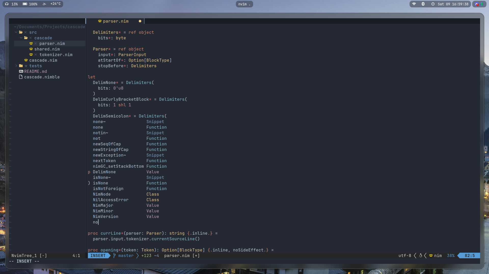
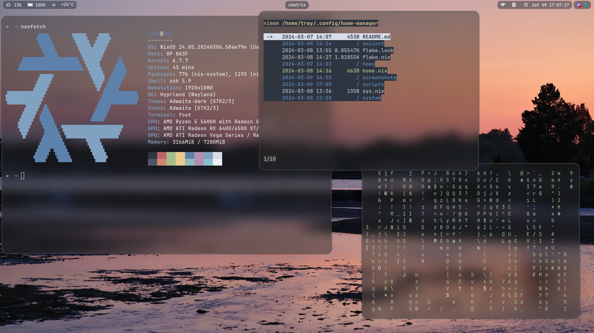
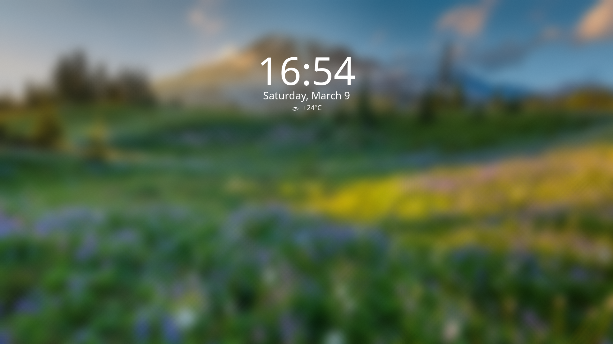

# My NixOS dotfiles
This is my 2nd attempt at NixOS, going better than my first run which was done completely blindly and ended... badly to say the least.

I'm using the Hyprland window manager with the Waybar status bar, the mako notification daemon, the Rofi app launcher (Wayland fork) and a screenshot script that uses grim and slurp. \
My dotfiles have been tested on AMD hardware only (both an AMD CPU and GPU). Intel *should* work fine, dunno about NVIDIA. My dotfiles also have secure boot support via lanzaboote. \
My old `configuration.nix` file is in the `ancient/` directory.

# Screenshots
## Neovim Configuration [Dotfiles](https://github.com/xTrayambak/dotfiles/tree/master/home/programs/neovim)

## My Hyprland desktop [Dotfiles](https://github.com/xTrayambak/dotfiles/tree/master/home/desktop/hyprland)

## My Bar [Dotfiles](https://github.com/xTrayambak/dotfiles/tree/master/home/desktop/waybar)

## Hyprlock [Dotfiles; requires flake to be set-up!](https://github.com/xTrayambak/dotfiles/tree/master/home/desktop/hyprlock)

# Programs Used
Wayland Compositor - [Hyprland](https://github.com/hyprwm/hyprland) \
Text Editor - [Neovim](https://github.com/neovim/neovim) \
Status Bar - [Waybar](https://github.com/Alexays/Waybar) \
Terminal Emulator - [Wezterm](https://github.com/wez/wezterm) \
Shell - [Zsh + Oh My Zsh!](https://www.zsh.org) \
PDF Reader - [Zathura](https://github.com/pwmt/zathura) \
Video Viewer - [Mpv](https://github.com/mpv-player/mpv) \
Video Recorder - [OBS Studio](https://github.com/obsproject/obs-studio) \
Image Viewer - [Loupe](https://apps.gnome.org/Loupe) \
File Manager GUI - [Nautilus](https://apps.gnome.org/Nautilus) \

# Acknowledgements
A lot of things here are just cobbled from different places, and I've forgotten most of them.

I used [fufexan's dotfiles](https://github.com/fufexan/dotfiles) to set up a flake, among other things. He was pretty helpful about getting secure boot running too. :D \
I used [justinlime's dotfiles](https://github.com/justinlime/dotfiles) to set up some other stuff.
